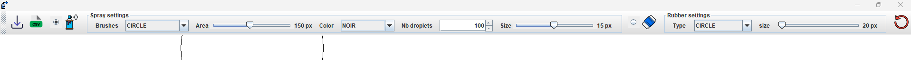
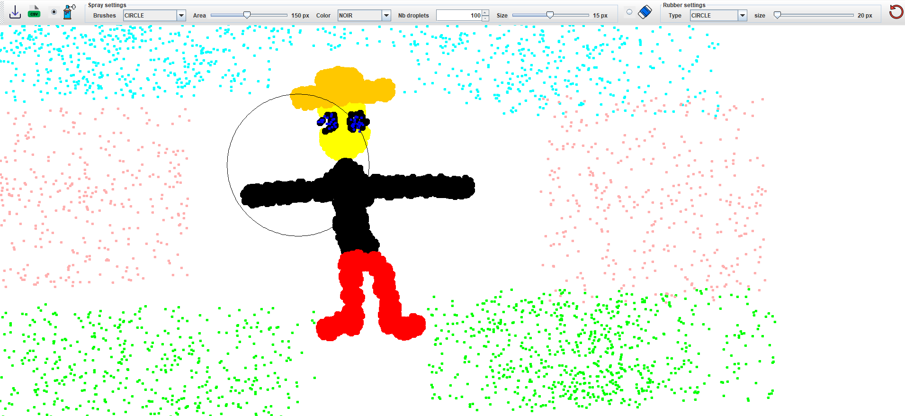

# Spray

Mini drawing application on Java (school project) carried out during my second year of Bachelor at Haute Ecole Arc Ingéniérie for the course of "Java II".

## Getting Started

You just have to clone the repository and compile the main file 'Main.java' or if you want build the project (Assuming you have a functional Java environment).

NB : You'll need to add to Classpath the jar file `images/images_tp_spray.jar` to have the icons of the tools in the toolbar (else you'll have a `NullPointerException`).

## Overview

This is not a traditional painting application, several features are available :
* choose the format of your spray (rectangle or circle) : a spray is defined as a certain number of droplets (adjustable) randomly generated in the brush area. 
* choose the color of your spray.
* remove a spray with an eraser (shape and size are adjustable)
* save or load in a csv file your work of art ;) (some examples are provided in the repo in `example_draw/`)

the tool bar of the app (containing all the features) : 

Example of a drawing : 

Enjoy !